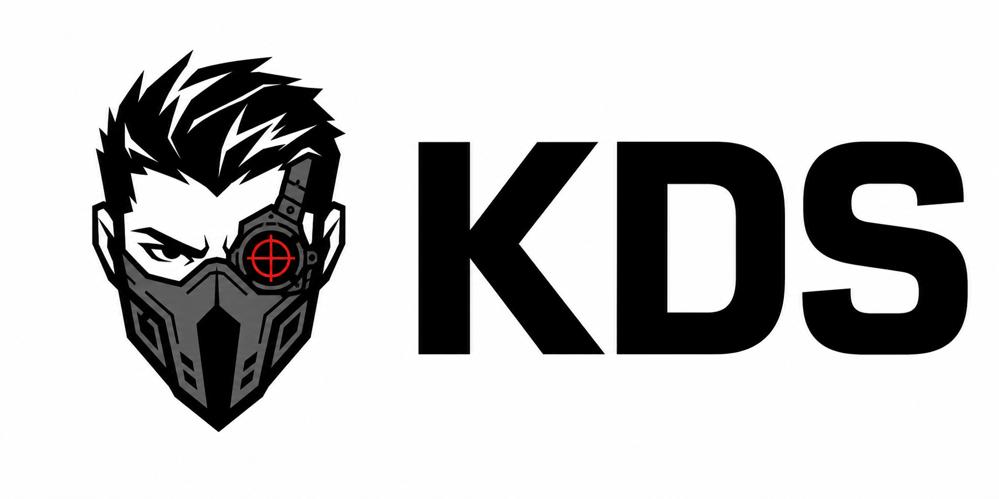

# KDS: Kill Dev Servers

<p>
  
</p>

KDS is a tiny Linux CLI that safely stops local JavaScript dev servers without touching Docker containers or editor processes.

It scans TCP listeners and stops process groups that look like host development servers:

- `bun`, `npm`, `pnpm`, or `yarn` running `dev`
- `vite`
- `next dev`
- `turbo ... dev`
- `wrangler dev`
- `workerd`

It skips Docker/container-owned processes and actual Electron/Code listener processes.

## Requirements

- Linux with `/proc`
- Bash 4 or newer
- procps-style `ps`, plus common shell tools such as `sort`, `tr`, and `grep`
- `ss` from iproute2 or `lsof` for TCP listener discovery

Alpine/BusyBox-style systems and macOS are not currently supported targets.
For NixOS, install or wrap the runtime dependencies in your Nix/home-manager
configuration instead of relying on shell rc file edits.

## Install

Run the installer:

```sh
curl -fsSL https://raw.githubusercontent.com/zanellig/kds/main/install.sh | bash
```

The installer:

- clones this repo to `~/.local/share/kds/repo`
- installs `kds` to `~/.local/bin/kds`
- prompts before reinstalling if `kds` is already installed
- adds a `kds` alias to existing shell rc files
- adds agent instructions to common global instruction files for Codex, Claude Code, OpenCode, Gemini CLI, and generic AGENTS.md-aware tools
- writes only global/user-level agent instruction files

You can override paths:

```sh
KDS_INSTALL_DIR="$HOME/bin" bash install.sh
KDS_CLONE_DIR="$HOME/src/kds" bash install.sh
```

For CI, distro packaging, or isolated install tests, skip global agent
instruction updates:

```sh
KDS_SKIP_AGENT_INSTRUCTIONS=1 bash install.sh
```

If `kds` is already installed, the installer asks whether to reinstall it. For
non-interactive installs, set `KDS_REINSTALL=1` to reinstall or
`KDS_REINSTALL=0` to keep the existing installation unchanged.

The installer respects common agent/config overrides including `CODEX_HOME`,
`CLAUDE_CONFIG_DIR`, `OPENCODE_HOME`, and `XDG_CONFIG_HOME`.

## Manual Install

Clone the repo and install the script somewhere on your `PATH`:

```sh
git clone https://github.com/zanellig/kds.git
mkdir -p "$HOME/.local/bin"
cp kds/kill-dev-servers.sh "$HOME/.local/bin/kds"
chmod +x "$HOME/.local/bin/kds"
```

Make sure `~/.local/bin` is on your `PATH`. For zsh:

```sh
echo 'export PATH="$HOME/.local/bin:$PATH"' >> ~/.zshrc
source ~/.zshrc
```

For bash:

```sh
echo 'export PATH="$HOME/.local/bin:$PATH"' >> ~/.bashrc
source ~/.bashrc
```

If you do not want to add `~/.local/bin` to your `PATH`, use an alias instead:

```sh
alias kds="/path/to/kill-dev-servers.sh"
```

## Usage

Preview what would be stopped:

```sh
kds --dry-run
```

Stop matching dev servers:

```sh
kds
```

## Shell Alias

If you prefer to edit your shell rc file manually, add this to `~/.zshrc`,
`~/.bashrc`, or the equivalent file for your shell:

```sh
alias kds="/path/to/kill-dev-servers.sh"
```

Then reload your shell:

```sh
source ~/.zshrc
```

Use:

```sh
kds --dry-run
kds
```
